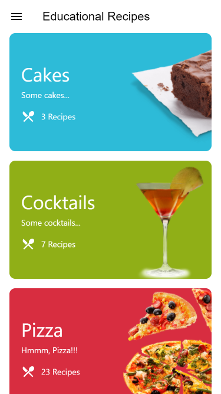
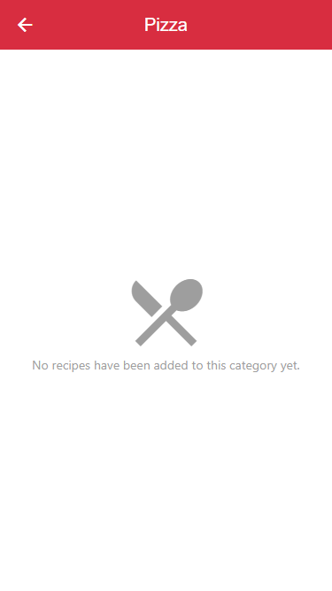

  <h1>Bildungsrezepte / Educational Recipes</h1>
  <strong>A recipe app for educational purposes with Flutter &amp; Dart for iOS, Android and Web.</strong>
   

---

The app "Educational Recipes" is an experiment with [Flutter](https://flutter.io/) and 
[Firebase](https://firebase.google.com/) and is used for studies of the author.

The source code written in Dart can be found in the lib folder.

Feel free to open up your own Firebase project and to compile and install the app to your iOS or Android device.
You can also drop me a note and join the beta testers.

For a quick preview a web app version is also available: 
[education-recipe-app.web.app](https://education-recipe-app.web.app/)

> :warning: To compile the web app on your own you have to switch to the beta channel of Flutter at present as this functionality is in an early stage.

## Tools

- Flutter
- Firebase Cloud Firestore
- Firebase Storage
- Firebase App Distribution

For a full description of OSS used, see pubspec.yaml

## UI Shots

  <table>
    <tr>
      <td style="text-align: center">
        
      </td>
      <td style="text-align: center">
        
      </td>
      <td style="text-align: center">
        
      </td>
      <td style="text-align: center">
        
      </td>
      <td style="text-align: center">
        
      </td>
    </tr>
  </table>

